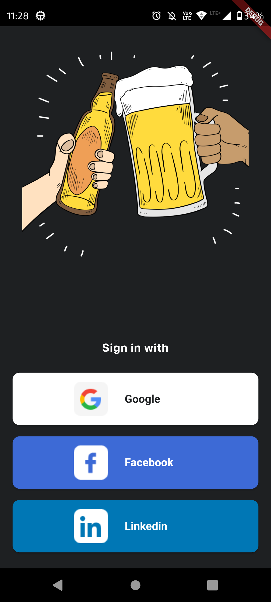
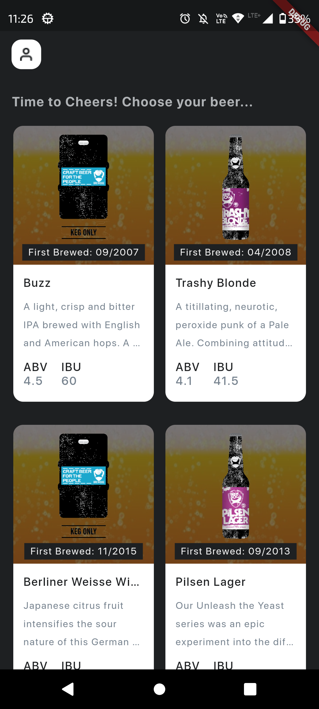
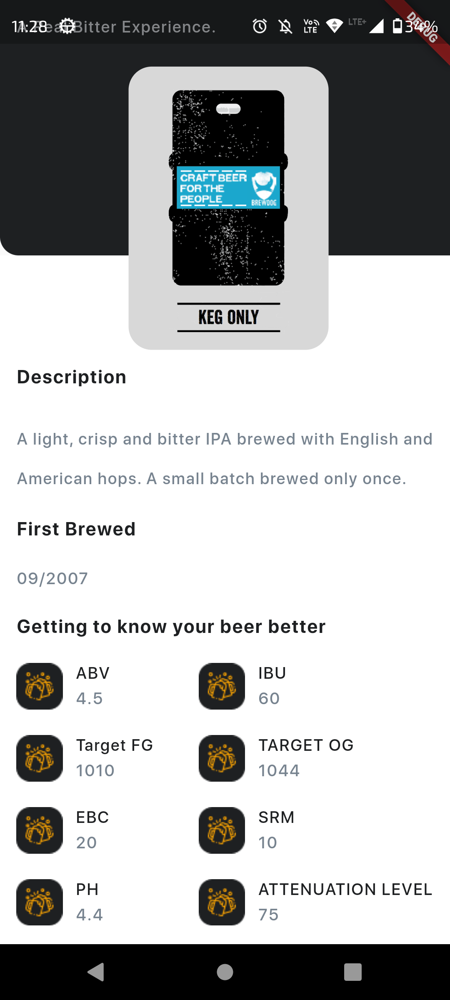
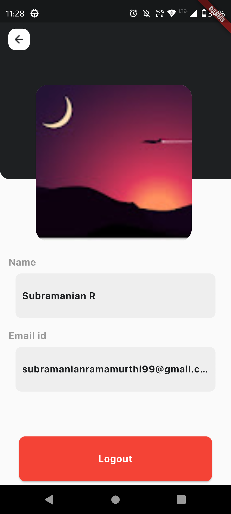

# Shop Savvy

Shop Savvy is a mobile application built using Flutter that allows users to browse and view products. It includes features such as social login, product listing, product details, and user profile management.

## Screens

The application consists of the following screens:

1. **Login**: This screen is displayed when the user is not logged in. It provides social login options using Google or LinkedIn.

2. **Home**: After successful login, the user is redirected to the home screen. This screen displays a list of products fetched from the backend using the Punk API. The products are presented in a scrollable list view, supporting pull-to-refresh and scroll-to-load-more functionality.

3. **Product Detail**: When a user selects a product from the home screen, the product detail screen is displayed. This screen provides comprehensive details about the selected product as received from the API.

4. **Profile**: The profile screen contains basic user information and an option to logout.

## Screenshots
| | | | |
|:-------------------------:|:-------------------------:|:-------------------------:|:-------------------------:|
| |   |  |  |


## Requirements

To set up and run the application, please ensure you have the following:

- Flutter SDK (minimum version 3.10.0)
- Dart SDK (minimum version 3.0.0)
- A code editor (e.g., Visual Studio Code)
- Emulator or physical device for testing
- Firebase project with Firebase Authentication enabled

## Installation Instructions

1. Clone the repository to your local machine:

```bash
git clone [repository_url]
```
2. Change to the project directory:
```bash
cd shop-savvy
```
3.Install the required dependencies:
```bash
flutter pub get
```

## Installation Instructions

1. Clone the repository to your local machine:

```bash
git clone [repository_url]
Change to the project directory:


cd shop-savvy
Install the required dependencies:

flutter pub get
```

Configure Firebase Authentication:
1. Create a new Firebase project in the Firebase Console.
2. Enable Firebase Authentication in your project.
3. Download the google-services.json file from the Firebase project settings.
4. Place the google-services.json file in the android/app directory of your Flutter project.
5. Update the android/build.gradle file as follows:
```groovy
buildscript {
    dependencies {
        // ...
        classpath 'com.google.gms:google-services:version-number' // Update the version number
    }
}

allprojects {
    // ...
    repositories {
        // ...
        google() // Add this line
    }
}
```
Configure Firebase function
1. **Prerequisites:**
   - Make sure you have the Firebase SDK for Flutter installed in your project. You can follow the official FlutterFire documentation for installation instructions.
   - Additionally, you will need to have Node.js and npm (Node Package Manager) installed on your machine to work with Firebase Functions.

2. **Set up Firebase Functions:**
   - Open your project in the Firebase console (https://console.firebase.google.com) and navigate to the project settings.
   - In the "General" tab, scroll down to the "Your apps" section and click on the "Add app" button.
   - Select the platform "Web" and register your app by following the instructions provided. Make sure to copy the Firebase configuration values (e.g., API key, project ID) as you will need them later.

3. **Create a Firebase Functions project:**
   - Open a command-line interface and navigate to the root directory of your Flutter project.
   - Run the following command to create a new Firebase Functions project:
     ```
     firebase init functions
     ```
   - Choose an existing Firebase project or create a new one.
   - Select the option to set up TypeScript as the language for your functions.
   - Install the required dependencies by running the following command:
     ```
     cd functions
     npm install firebase-admin
     ```

4. **Generate a custom token in Firebase Functions:**
   - In your Firebase Functions project, open the `index.ts` file located in the `functions/src` directory.
   - Import the necessary modules and initialize Firebase Admin:
     ```typescript
     import * as functions from 'firebase-functions';
     import * as admin from 'firebase-admin';

     admin.initializeApp();
     ```
   - Implement a function to generate the custom token. Here's an example:
     ```typescript
     export const generateCustomToken = functions.https.onCall(async (data, context) => {
       const { uid, email } = data;

       try {
         const token = await admin.auth().createCustomToken(uid, { email });
         return { token };
       } catch (error) {
         throw new functions.https.HttpsError('internal', 'Failed to generate custom token', error);
       }
     });
     ```

Linkedin auth Provider
1. create and configure shop_savvy_secrets.json file refer sample.json for the format.
2. add client id, client secret to the shop_savvy_secrets.json file.
3. run flutter with --dart-define-from-file to configure the app with shopsavvy secrets.
```bash
flutter run --dart-define-from-file shop_savvy_secrets.json
```

Now the Shop Savvy app is configured with Firebase Authentication. Users can log in using the social login options provided (Google or LinkedIn).

## Dependencies and Libraries

The application utilizes the following dependencies and libraries:

- **flutter_bloc**: A state management library for Flutter, used for managing application state using the BLoC pattern.

- **go_router**: A routing library for Flutter, used for handling navigation between different screens in the application.

- **http**: A package for making HTTP requests, used for fetching data from the backend API.

- **firebase_auth**: The official Firebase plugin for Flutter, used for integrating Firebase Authentication.

- **firebase_functions**: The Firebase Functions plugin for Flutter, used for deploying and managing serverless functions on Firebase.

## Test Cases

To run the test cases, follow these steps:

1. Change to the project directory (if not already in):

```bash
cd shop-savvy
Run the tests using the following command:

flutter test
```
## Assumptions

The following assumptions were made during the development of the Shop Savvy application:

1. The user authentication process is handled entirely by the social login APIs (Google, LinkedIn) provided by Firebase Authentication.
2. The backend API provided by Punk API is used for retrieving the product data.
3. The design and layout of the application follow the specifications provided in the Figma design.
4. Meta now requires all NEWLY entered package names to be associated with a valid google play store URL hence facebook provider has not been implemented [link](https://developers.facebook.com/support/bugs/1307870196812047/?join_id=f12e5a3b52a432)

## Project Structure

The project follows a clean code architecture, with separation of concerns and modularity. It includes the following folders:

- **lib**: Contains the main application code.
  - **core**: contains all reusable widgets, themes and other core components.   
    - **repository**: Handles data-related operations, including API calls.
    - **models**:contains all the required models.
    - **routes**: Contains route definitions and navigation setup using Go Router.
    - **utils**: Provides utility functions and helper classes.
  - **presentation**: Contains the UI components and screens, organized by feature.
    - **controller**: Handles the state management using the BLoC pattern and connects the UI with the domain layer.
    - **view**: Contains the UI components and screens

